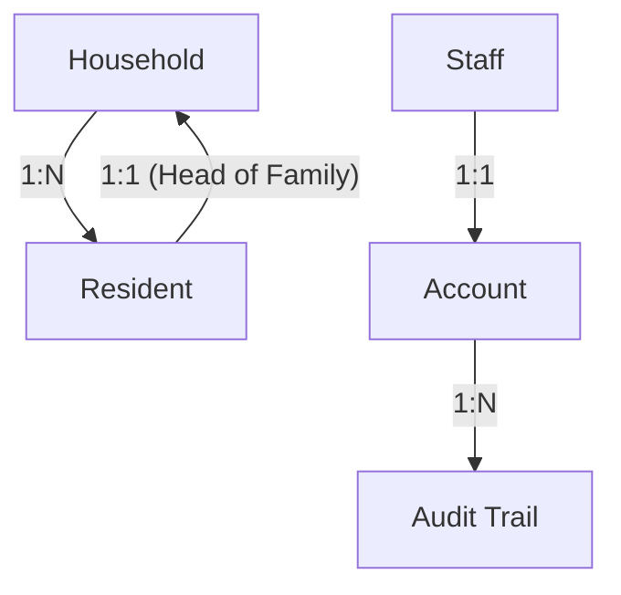

# NSR Population Tracker - Project Documentation

## 📋 Table of Contents
1. [Project Overview](#1-project-overview)
2. [Technology Stack](#2-technology-stack)
3. [Folder Structure](#3-folder-structure)
4. [Database Architecture](#4-database-architecture)
5. [Backend Architecture](#5-backend-architecture)
6. [Frontend Architecture](#6-frontend-architecture)
7. [User Flows](#7-user-flows)
8. [Security Implementation](#8-security-implementation)
9. [Deployment](#9-deployment)
10. [Potential Q&A](#10-potential-qa)

---

## 1. Project Overview

**NSR Population Tracker** is a comprehensive **Population Management System** developed for **Barangay New San Roque**. It serves as a digital solution to replace manual record-keeping, allowing barangay officials to efficiently track residents, households, and demographic statistics.

### Key Objectives
- **Digitize Records**: Move from paper-based to a secure digital database.
- **Real-time Statistics**: Instantly view population counts, gender distribution, and age demographics.
- **Household Management**: Organize residents by households and zones.
- **Audit Logging**: Track every change made to the data for accountability.

### User Roles
- **Admin (A)**: Full system access, including managing other user accounts.
- **Staff (S)**: Can manage residents and households, view audit trails.
- **Viewer (V)**: Read-only access to population data.

---

## 2. Technology Stack

### Backend
- **Language**: PHP 7.4+
    - **Why?** Widely supported, easy to deploy on XAMPP/shared hosting.
    - **Features Used**: PDO/MySQLi for database security, Sessions for auth, JSON for API responses.
- **Database**: MySQL / MariaDB
    - **Why?** Reliable relational database, perfect for structured data like census records.
- **Server**: Apache (via XAMPP or Docker)

### Frontend
- **Styling**: 
    - **Tailwind CSS**: Utility-first framework for rapid, custom UI development.
    - **Bootstrap 5.3**: Used for specific UI components like Modals and Alerts.
- **Scripting**: 
    - **jQuery 3.7.1**: Simplifies DOM manipulation and AJAX requests.
    - **Vanilla JS**: Used for lightweight logic.
- **Visualization**: Custom CSS/HTML implementation (Lightweight, no heavy charting libraries).
- **Icons**: Font Awesome 6.5
- **Fonts**: Fraunces (Headings), Outfit (Body)

### DevOps & Tools
- **Docker**: Containerization for consistent deployment across environments.
- **Git**: Version control.
- **XAMPP**: Local development environment.

---

## 3. Folder Structure

```
NSR-Population-Tracker/
├── assets/                 # Static assets
│   ├── css/               # Stylesheets (styles.css)
│   └── js/                # Frontend logic (app.js, dashboard.js, etc.)
├── backend/               # Server-side logic
│   ├── api/               # RESTful API endpoints (JSON responses)
│   │   ├── accounts.php   # User account management
│   │   ├── auth.php       # Login/Logout logic
│   │   ├── residents.php  # Resident CRUD
│   │   ├── households.php # Household CRUD
│   │   ├── statistics.php # Dashboard data
│   │   └── staff.php      # Staff profile management
│   ├── includes/          # Core classes and helpers
│   │   ├── db.php         # Database connection (Singleton)
│   │   ├── auth.php       # Session management
│   │   └── audit.php      # Audit logging system
│   ├── config.php         # Environment configuration
│   └── database.sql       # Database schema
├── admin.php              # Main Admin Dashboard (SPA-style)
├── index.php              # Public Landing Page
├── login.php              # Login Page
├── docker-compose.yml     # Docker configuration
└── README.md              # Project instructions
```

---

## 4. Database Architecture

The system uses a relational database with **5 main tables**.

### Entity Relationship Diagram (Conceptual)



### Key Tables & Schema Details

1.  **`residents`**
    *   **Purpose**: Stores individual resident data.
    *   **PK**: `resident_id` (UUID) - Ensures global uniqueness.
    *   **FK**: `household_id` (Links to `households` table).
    *   **Fields**: 
        - `first_name`, `last_name` (VARCHAR)
        - `birth_date` (DATE)
        - `gender` (ENUM: 'M', 'F') - Optimized storage.
        - `civil_status` (ENUM: 'S', 'M', 'W', 'SEP', 'D')
    *   **Indexes**: `idx_last_name` (Faster search), `idx_status` (Faster filtering).

2.  **`households`**
    *   **Purpose**: Groups residents living together.
    *   **PK**: `household_id` (UUID)
    *   **Fields**: `zone_num` (INT), `house_num` (VARCHAR).
    *   **FK**: `head_resident_id` (Links to `residents` table).
    *   **Constraint**: `ON DELETE SET NULL` - If a head resident is deleted, the household remains but with no head.

3.  **`account`**
    *   **Purpose**: System users who can log in.
    *   **PK**: `acc_id` (UUID)
    *   **Fields**: `username` (Unique), `password` (Bcrypt Hash), `role` (ENUM: 'A', 'S', 'V').
    *   **Security**: Passwords are never stored in plain text.

4.  **`staff`**
    *   **Purpose**: Public profiles for barangay officials.
    *   **PK**: `staff_id` (UUID)
    *   **Fields**: `title`, `category` (Leadership/Official/Health).

5.  **`audit_trail`**
    *   **Purpose**: Security log of all actions.
    *   **Fields**: 
        - `record_type` (ENUM: Household, Resident, Staff, Account)
        - `change_type` (ENUM: Create, Update, Delete)
        - `details` (TEXT) - Human readable description of change.
        - `acc_id` (FK) - Who made the change.

### Design Highlights
- **Circular Dependency Handling**: `households` needs a `head_resident_id`, and `residents` needs a `household_id`. This is solved by creating tables first, then adding the Foreign Key constraint via `ALTER TABLE`.
- **Soft Deletes**: Records have a `status` column. When "deleted", status becomes `'X'` (Archived). This preserves data integrity for the audit trail.

---

## 5. Backend Architecture

### API Design
The backend follows a **RESTful API** pattern. Frontend JavaScript communicates with PHP scripts in `backend/api/` via AJAX.

*   **GET**: Retrieve data (e.g., `GET api/residents.php`)
*   **POST**: Create new records (e.g., `POST api/auth.php` for login)
*   **PUT**: Update existing records.
*   **DELETE**: Remove/Archive records.

### Core Modules (`backend/includes/`)

1.  **Database (`db.php`)**:
    *   Uses **Singleton Pattern** to ensure only one database connection exists per request.
    *   Uses **PDO/MySQLi Prepared Statements** to prevent SQL Injection.

    ```php
    // Example: Singleton Usage
    $db = Database::getInstance();
    $conn = $db->getConnection();
    ```

2.  **Authentication (`auth.php`)**:
    *   Manages PHP Sessions.
    *   `requireLogin()`: Middleware to block unauthorized access.
    *   `requireAdmin()`: Middleware to restrict admin-only features.

3.  **Audit (`audit.php`)**:
    *   Automatically logs actions when data is modified.
    *   Captures: User ID, Action Type (Create/Update/Delete), and Description.

---

## 6. Frontend Architecture

### Single Page Application (SPA) Feel
The `admin.php` page acts like an SPA. It doesn't reload the entire page when navigating. Instead, **JavaScript (`app.js`)** dynamically hides/shows sections.

```javascript
// Simplified Routing Logic in app.js
function navigateTo(page) {
    $('.content-section').hide(); // Hide all
    $(`#${page}-section`).show(); // Show requested
    loadDataFor(page);            // Fetch data via API
}
```

### JavaScript Modules (`assets/js/`)
*   **`auth.js`**: Handles Login/Logout AJAX requests.
*   **`dashboard.js`**: Renders charts and statistics using the Stats API.
*   **`residents.js`**: Manages the Resident table, Add/Edit modals.
*   **`households.js`**: Manages Household data and linking residents.
*   **`audit.js`**: Fetches and displays the audit logs.

---

## 7. User Flows

### 1. Login Flow
```
[User] -> Enters Credentials -> [login.php]
                                    |
                                    v
                            [POST api/auth.php]
                                    |
                            (Verify Password Hash)
                                    |
                            [Success: Create Session] -> Redirect to [admin.php]
                            [Fail: Return Error]      -> Show Alert
```

### 2. Dashboard Loading Flow (SPA)
When the user logs in, the dashboard loads data asynchronously:
1.  **Page Load**: `admin.php` loads the skeleton HTML structure.
2.  **JS Init**: `dashboard.js` triggers multiple AJAX calls in parallel:
    *   `GET api/statistics.php/population` -> Updates Total Population/Households cards.
    *   `GET api/statistics.php/zones` -> Updates Zone Statistics list.
    *   `GET api/statistics.php/age-distribution` -> Updates Age Demographics bars.
3.  **Render**: As data arrives, the UI updates from "Loading..." spinners to actual numbers.

### 3. Adding a Resident (Staff/Admin)
1.  User clicks **"Add Resident"** button.
2.  Modal opens. User fills form (Name, DOB, Gender, etc.).
3.  User clicks **Save**.
4.  JS sends `POST` request to `api/residents.php`.
5.  **Backend**:
    *   Validates input (e.g., required fields).
    *   Generates UUID for `resident_id`.
    *   Inserts into `residents` table.
    *   **Audit System**: Logs "Added resident [Name]" into `audit_trail`.
6.  **Frontend**: Refreshes the resident table to show new data.

### 4. Creating a Household
1.  User navigates to **Households** tab.
2.  Clicks **"Add Household"**.
3.  Enters Zone Number and House Number.
4.  **Backend**: Creates the household record.
5.  **Linking**: User can now edit the household to assign a **Head of Family** from existing residents.
    *   This updates the `head_resident_id` in the `households` table.
    *   This creates a two-way link: Household contains Resident, Resident leads Household.

---

## 8. Security Implementation

1.  **Password Hashing**:
    *   Passwords are **never** stored in plain text.
    *   Uses `password_hash($pass, PASSWORD_DEFAULT)` (Bcrypt) for storage.
    *   Uses `password_verify()` for login.

2.  **SQL Injection Protection**:
    *   All database queries use **Prepared Statements**.
    *   Example: `SELECT * FROM users WHERE id = ?` (Input is treated as data, not code).

3.  **Access Control (RBAC)**:
    *   Backend checks `$_SESSION['role']` before performing sensitive actions (like deleting accounts).
    *   API endpoints return `403 Forbidden` if a non-admin tries to access admin features.

4.  **Audit Trail**:
    *   Every modification is recorded. This prevents "silent" changes and ensures accountability.

---

## 9. Deployment

The project supports two deployment modes:

### A. XAMPP (Local)
1.  Place project in `htdocs`.
2.  Import `backend/database.sql` into phpMyAdmin.
3.  Configure `backend/config.php` (if defaults need changing).

### B. Docker (Containerized)
Uses `docker-compose` to spin up:
1.  **App Container**: PHP 7.4 + Apache.
2.  **DB Container**: MySQL 8.0.

**Command**: `docker-compose up -d`

---

## 10. Potential Q&A

### Technical Decisions

**Q: Why did you use UUIDs instead of Auto-Increment IDs?**
**A:** UUIDs (Universally Unique Identifiers) allow data to be merged from different systems without ID conflicts. They are also more secure as they don't reveal the number of records in the database (e.g., `resident_id=5` vs `resident_id=100`).

**Q: Why PHP 7.4?**
**A:** It provides a stable, widely-supported environment that is easy to deploy on standard hosting providers (like XAMPP). It offers strong type hinting and performance improvements over older versions.

**Q: Why not use a framework like Laravel?**
**A:** For this specific scope, a native PHP implementation reduces overhead and complexity. It demonstrates a strong understanding of core programming concepts (OOP, MVC patterns, Singleton) without relying on "magic" framework methods.

### Database & Data Integrity

**Q: How is the "Soft Delete" implemented?**
**A:** When a resident is "deleted", we don't actually remove the row from the database. We update their status column to `'X'` (Archived). This preserves historical data and maintains referential integrity for the audit trail.

**Q: How do you handle the relationship between Households and Residents?**
**A:** It's a 1-to-Many relationship (One Household has Many Residents). However, we also have a specific 1-to-1 relationship for the "Head of Family". We handle this with Foreign Keys in both tables, ensuring data consistency.

**Q: Is the database normalized?**
**A:** Yes, mostly to 3NF. Repeated data (like Gender, Civil Status) uses ENUMs or codes to minimize redundancy. Address data is stored in the Household table and referenced by Residents, preventing address duplication.

### Security

**Q: How do you prevent SQL Injection?**
**A:** We use **PDO/MySQLi Prepared Statements** for ALL database queries. This separates the SQL code from the data, making it impossible for an attacker to inject malicious SQL commands via input fields.

**Q: How are passwords secured?**
**A:** We use `password_hash()` with the **Bcrypt** algorithm. We never store plain text passwords. Even if the database is compromised, the passwords remain unreadable.

**Q: What is the Audit Trail for?**
**A:** It provides accountability. If data is changed or deleted, the Admin can see exactly **who** did it and **when**. This is crucial for official government records.

### Future Improvements

**Q: How would you scale this application?**
**A:** 
1.  **Pagination**: Currently, we load lists. For thousands of residents, we would implement server-side pagination (LIMIT/OFFSET).
2.  **Caching**: We could cache the dashboard statistics (Redis/Memcached) so we don't calculate them on every page load.
3.  **Cloud Storage**: Move images (staff photos) to S3 or similar object storage instead of the local file system.
